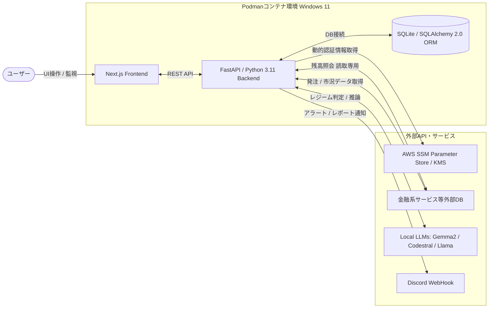

# AI駆動型 統合資産管理・自動運用プラットフォームアプリケーションソフトウェア  
※本ソフトウェアは現在設計・開発途中のものになります。  

> **【リポジトリ公開に関するポリシー】**
> 本リポジトリは、自動運用システムの「アーキテクチャ設計」「UI/UX」「堅牢なインフラストラクチャ」のショーケースとして公開しています。**具体的な投資アルゴリズム、資産配分比率の閾値、およびAI推論用のプロンプト等は非公開**としています。


##  主要機能（ユーザー体験と恩恵）
直感的なUIを通じ、資産状況の把握からAIの意思決定プロセスの透明化までをシームレスに提供します。

*   **1スクロールダッシュボード**: 銀行残高、買付余力、株式・投資信託のポートフォリオ総額、割合、評価損益を「1スクロール以内」で俯瞰できるUIを提供。
*   **多角的な時間軸分析**: 「日次（騰落・振替実績）」「月次（成長曲線）」「年次（年間利回り）」の3つの時間軸で資産推移を可視化。
*   **イントラデイ（日中）監視とレジーム判定**: アクティブ時間帯における分単位の損益推移グラフ、VWAP乖離率、およびAIによる相場環境（レジーム）判定フラグをオーバーレイ表示。
*   **AI思考プロセスと損失理由の透明化**: AIがどの銘柄を分析し、なぜその売買を行ったのかをタイムライン化。損失発生時にはログから「何故損失になったか」を抽出し、ドリルダウンで明確に提示します。
*   **運用レポート・アルバム機能**: 取引終了後にAIが自動生成する振り返りレポート（If-Thenシナリオや改善案）をカレンダー・リスト形式でアーカイブ。

##  技術スタック
個人運用スケールでありながら、将来の拡張性と高い再現性を見据えたモダンなスタックを採用しています。

*   **インフラ・コンテナ環境**: Windows 11 Host / Podman / `docker-compose`
*   **バックエンド**: Python 3.11, FastAPI, pandas/numpy (分析ロジック), SQLAlchemy 2.0
*   **フロントエンド**: Next.js, CSS Modules (ダークモード・グラスモーフィズムデザイン)
*   **データベース**: SQLite (ローカル運用デフォルト)
    *   *Note: SQLAlchemyのORM層を活用し、RDBMSに依存しない設計（将来のPostgreSQLへのシームレスな移行）を実現しています。*
*   **AI・推論エンジン**: Local LLMs (Gemma2, Codestral, Llama) 

##  セキュリティ・フェイルセーフ (Secure by Design)
本システムの最重要課題である、インフラおよびアプリケーション層のリスク管理機構です。

1.  **機密情報の完全分離 (AWS SSM Integration)**
    APIキーやクレデンシャルのソースコード内への直書きを完全排除。AWS SSM Parameter Store (KMS暗号化) を利用し、コンテナ実行時に動的に認証情報を取得・オンメモリで管理します。
2.  **資産ドローダウン検知とキルスイッチ V2**
    ポートフォリオが短時間で規定の閾値（例: 3%）減少した場合、システムが即座に「新規買付注文」をハードブロックします。この状態は物理ファイルで永続化され、既存ポジションの決済（Exit）のみを許可する非対称オーバーライド設計を採用しています。
3.  **生活防衛費保護（ガードレール機構）**
    API経由での銀行口座アクセスは「読取専用」として扱い、出金機能を意図的にブロックすることで、システム暴走時でも生活防衛費を物理的に保護します。
4.  **全層ロギングとスマート通知**
    例外発生時には `[COMPONENT]` タグを付与して原因レイヤー（DB, Web, API）を明確化し、Discordへ即時プッシュ通知を行うトレーサビリティを確保しています。

##  構成ディレクトリ
保守性と単一責任の原則（SRP）を厳守したクリーンアーキテクチャベースの構成です。

```text
/trading-system
├── docker-compose.yml       # コンテナ群の環境定義
├── .env                     # 環境変数 (Git管理外)
├── /data                    # 永続化マウント (SQLite DB, Reports, Logs)
├── /frontend                # Next.js UIソースコード
└── /backend                 # Python 3.11 API & Worker
    ├── pyproject.toml
    └── /src
        ├── /api             # 各種外部APIリクエスト (Mock切り替え機構付き)
        ├── /core            # AWS SSM復号処理、Discord通知等の共通基盤
        ├── /models          # SQLAlchemyテーブル定義
        ├── /routers         # FastAPIエンドポイント群
        ├── /strategy        # 【非公開】自動取引ロジック・推論モデル群
        └── /runner          # メインジョブスケジューラ

【Disclaimer (免責事項)】  
本件は個人の技術的実験を目的としたものであり、金融商品取引法に基づく投資助言を提供するものではありません。AIの推論や自動取引ロジックは利益を保証せず、損失をもたらす可能性があります。著作者は本ソフトウェアの使用によって生じたいかなる損害についても一切の責任を負いません。
