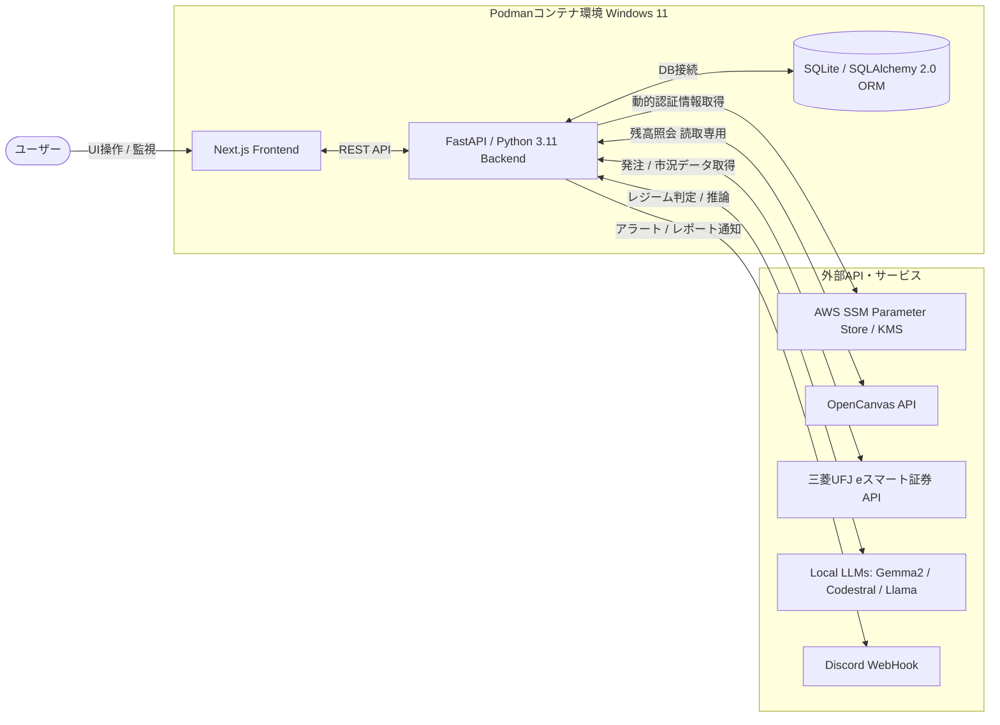

# AI-Driven Secure Asset Management & Trading Platform Application Software
**AI駆動型 統合資産管理・自動運用プラットフォームアプリケーションソフトウェア**  
※本ソフトウェアは現在設計途中のものになります。

##  主要機能（ユーザーが受ける恩恵）
ユーザーがダッシュボード上で直感的に実行・確認できる機能の一覧です。

*   **1スクロールダッシュボード**: 銀行残高、買付余力、株式・投資信託の総額、割合、評価損益を「1スクロール以内」で俯瞰できるUIを提供します。
*   **ポジションの詳細照会機能**: 投資信託および長期運用（コア・サテライト）における具体的な保有銘柄名、口数/株数、取得単価、現在値、個別の評価損益をドリルダウンで一覧表示します。
*   **多角的な時間軸分析**: 
    *   **日次**: 騰落および振替実績の確認
    *   **月次**: 資産クラス別積み上げ成長曲線の可視化
    *   **年次**: 年間利回りと生活防衛費の安定性推移
*   **短期トレード・イントラデイ詳細**: アクティブ時間帯（09:15〜14:50）の分単位の実現・未実現損益推移グラフ、VWAP乖離率、AIのレジーム判定フラグをオーバーレイ表示します。
*   **AI思考プロセスと損失理由の透明化**: AIがどの銘柄を分析し、どのような結果に至ったかをタイムラインで確認可能。損失発生時にはログから抽出した「何故損失になったか」を明確に提示します。
*   **レポート・アルバム機能**: 取引終了後にAIが自動生成する振り返りレポート（If-Then分析・改善案）を蓄積し、カレンダーやリスト形式でいつでも閲覧できる専用ページを提供します。

##  技術スタック
*   **インフラ・実行環境**: Windows 10/11 ホスト / Podman / `docker-compose` によるコンテナ管理
*   **バックエンド**: Python 3.11, FastAPI, pandas/numpy (分析ロジック), SQLAlchemy 2.0
*   **フロントエンド**: Next.js, CSS Modules (Tailwind非推奨 / ダークモード・グラスモーフィズム等の高品質デザイン)
*   **データベース**: SQLite (`backend/src/data.db`) を採用した個人ローカル運用前提の設計。SQLAlchemy 2.0 ORM を用いて PostgreSQL 互換 SQL を生成し、将来のクラウド化（PostgreSQL移行）にシームレスに対応します。

##  セキュリティ・フェイルセーフ (Secure by Design)
本システムのコアバリューである、インフラおよびアプリケーション層のリスク管理機構です。

1.  **機密情報の完全分離 (AWS SSM Integration)**
    APIキーやクレデンシャルのソースコード内への直書きを完全禁止しています。AWS SSM Parameter Store (KMS暗号化) を利用し、コンテナ実行時に動的に認証情報を取得するセキュアな設計を実装しています。
2.  **資産ドローダウン検知とキルスイッチ**
    ポートフォリオが短時間で閾値（例: 3%）減少した場合、新規買付注文を即座にブロックする `is_kill_switch_active` フラグを発動させます。この状態はDBおよび物理的な `.kill.lock` ファイルで永続化され、コンテナ再起動時でもブロック状態を維持します。また、ショート建玉の買い戻し決済（Exit）は許可する非対称オーバーライド設計を採用しています。
3.  **生活防衛費ブロック (ガードレール機構)**
    人間が設定した固定費にはAIはアクセスできず、銀行口座（OpenCanvas）は読取専用として扱い、出金機能は意図的に使用しない独立プールアーキテクチャとしています。
4.  **全層ロギングとスマート通知**
    システムエラーや例外をキャッチした際、原因レイヤー（DB, Web, API）を明確にする `[COMPONENT]` タグを付与し、Discordへ即時プッシュ通知を行います。

##  構成ディレクトリ
保守性とSRP（単一責任の原則）を厳守した構成です。

*   `/frontend` - Next.js のフロントエンドソース
*   `/backend/src/api` - 各種外部APIリクエストモジュール (Mock切り替え機構付き)
*   `/backend/src/core` - AWS SSMパラメータ復号処理、Discord通知ロジック、構造化ロガー等の共通基盤
*   `/backend/src/strategy` - 自動取引ロジック推論モデル (V6コア、VWAP等)
*   `/data/reports` - AIが自動生成する運用レポート（If-Then分析・改善点）の実体ファイル格納庫

【Disclaimer (免責事項)】  
本件は個人の技術的実験を目的としたものであり、金融商品取引法に基づく投資助言を提供するものではありません。AIの推論や自動取引ロジックは利益を保証せず、損失をもたらす可能性があります。著作者は本ソフトウェアの使用によって生じたいかなる損害についても一切の責任を負いません。
