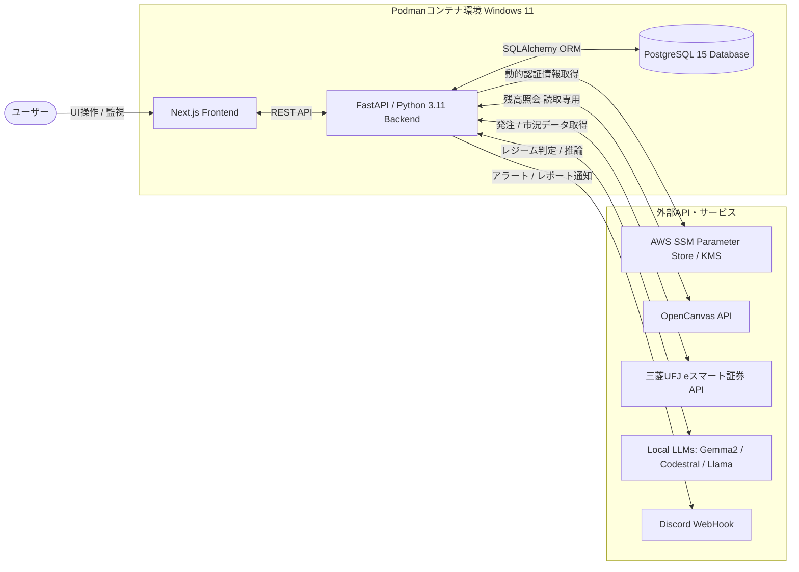

# AI-Driven Secure Asset Management & Trading Platform Application Software
**AI駆動型 統合資産管理・自動運用プラットフォームアプリケーションソフトウェア**

【基本的なコンセプト】  
Privacy First & Secure by Design: APIキーなどの機密情報はAWS SSM/KMSで動的に管理し、ソースコードへのハードコードを徹底排除しています。

Local Intelligence: Ollamaを用いたローカルLLM基盤により、外部APIにデータを送ることなく、高度な市場分析と意思決定を行います。

Hybrid Strategy: Gemma 2による長期運用ロジックと、Codestral/Llamaによる短期VWAP平均回帰ロジックを組み合わせたハイブリッド運用を実現します。

【主要機能】  
ユーザーがダッシュボード上で実行・確認できる機能の一覧です。

1スクロールダッシュボード: 銀行残高、買付余力、株式・投資信託の総額、割合、評価損益を「1スクロール以内」で一覧表示。

ポジション照会機能: 投資信託および長期運用（コア・サテライト）における保有銘柄、口数/株数、取得単価、現在値、個別損益のドリルダウン表示。

多角的な時間軸分析:

日次▷ 騰落および振替実績

月次▷資産クラス別積み上げ成長曲線

年次▷年間利回りと生活防衛費の安定性推移

短期トレード・イントラデイ可視化: アクティブ時間帯（09:15〜14:50）の分単位の実現/未実現損益推移、VWAP乖離率、AIのレジーム判定フラグをオーバーレイ表示。

AI思考プロセスのタイムライン化: エンジンが下した判断基準、レジーム判定結果、各取引における「なぜその売買（損失）を行ったか」を可視化。

レポート・アルバム: 取引終了後にAIが自動生成する日次・月次・年次の振り返りレポート（If-Then分析・改善案）をカレンダー・リスト形式でアーカイブ。

【技術スタック】  
インフラ・実行環境: Windows 11ホスト / Podman / docker-compose

バックエンド: Python 3.11, FastAPI, pandas/numpy (分析ロジック), SQLAlchemy 2.0

フロントエンド: Next.js, CSS Modules (Tailwind非推奨 / ダークモード・グラスモーフィズムデザイン)

データベース: PostgreSQL 15 (JSONB型を活用した財務データ・ログ管理)

【セキュリティ・フェイルセーフ】  
1.機密情報の完全分離 (AWS SSM Integration)
APIキーやクレデンシャルのコード内への直書きを完全禁止しています。AWS SSM Parameter Store (KMS暗号化) を利用し、コンテナ実行時に動的に認証情報を取得するセキュアな設計を実装しています。

2.資産ドローダウン検知とキルスイッチ  
ポートフォリオが短時間で閾値（例: 3%）減少した場合、新規買付注文を即座にブロックする is_kill_switch_active フラグを発動させます。この状態はDBおよび物理的な .kill.lock ファイルで永続化され、コンテナ再起動時でもブロック状態を維持します。

3.生活防衛費ブロック (ガードレール機構)
人間が設定した固定費にはAIはアクセスできず、銀行口座（OpenCanvas）は読取専用として扱い、出金機能は意図的に使用しないアーキテクチャとしています。

4.全層ロギングとスマート通知
キャッチしたExceptionにすべて [COMPONENT] を付与し、原因レイヤー（DB, Web, API）を明確化してDiscordへ即時プッシュ通知を行います。

【取引エンジンとAIロジック】  
本システムは、「投資判断ファースト原則（AIが利益見込みありと判断した場合のみ投資を実行する）」を最上位の設計思想としています。

長期運用（Gemma 2）: EDINET等のFCFやEBITDA財務データ、金利や為替の環境下で、投資の安全性をマクロ視点でスコアリングします。

短期トレード（VWAP平均回帰 + Local LLMs）: フラクショナル微分等によるデータ定常化と、大口発注（機関投資家の壁）の検知・見せ板排除アルゴリズムを使用。さらにローカルLLMを用いて最新の市況ニュースを構造化し、エッジが機能しない「トレンド・デイ」などを検知するレジーム判定を補助します。

利益振替と動的リバランス: 短期枠の確定利益の50%を長期コアへ移管するProfit Sweep機構と、四半期定期・VIXギアシステム・手動トリガーで発動する動的ポートフォリオ比率の更新機能（Tolerance Band）を実装しています。

【構成ディレクトリ】  
保守性とSRP（単一責任の原則）を厳守した構成です。  
/frontend - Next.js UIソース  

/backend/src/api - 各種外部APIリクエストモジュール (Mock切り替え機構付き)    

/backend/src/core - AWS SSM復号処理、Discord通知ロジック、構造化ロガー  

/backend/src/strategy - 取引ロジック推論モデル (V6コア、VWAP等)  

/data/reports - AIが自動生成する運用レポート（If-Then分析・改善点）の実体ファイル格納庫  

【Disclaimer (免責事項)】  
本件は個人の技術的実験を目的としたものであり、金融商品取引法に基づく投資助言を提供するものではありません。AIの推論や自動取引ロジックは利益を保証せず、損失をもたらす可能性があります。著作者は本ソフトウェアの使用によって生じたいかなる損害についても一切の責任を負いません。
